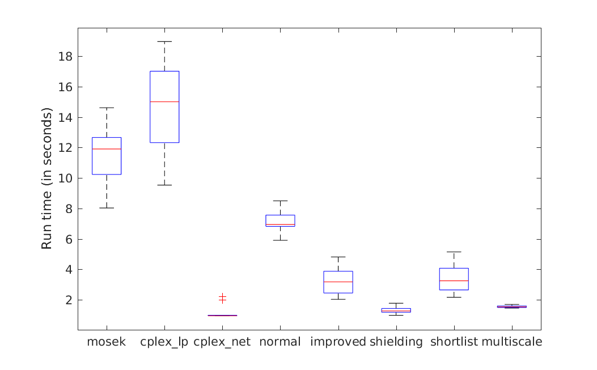
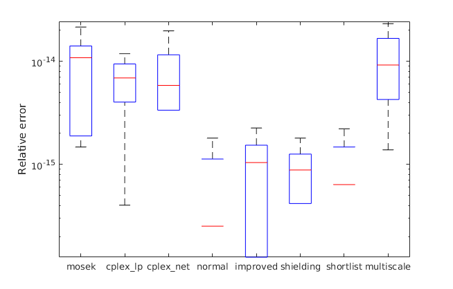
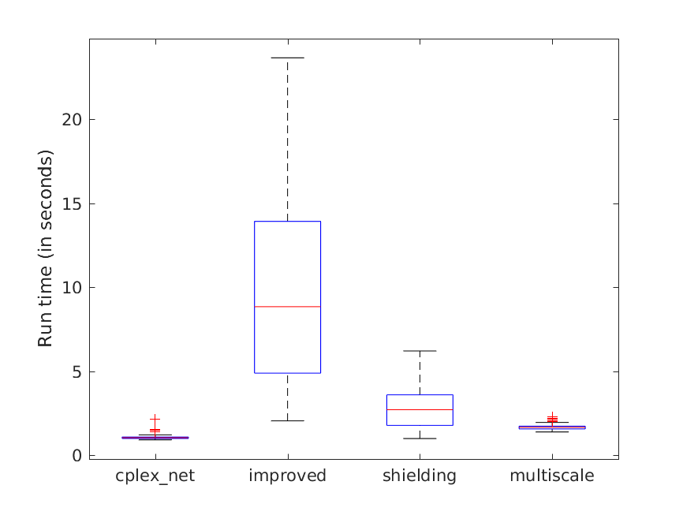
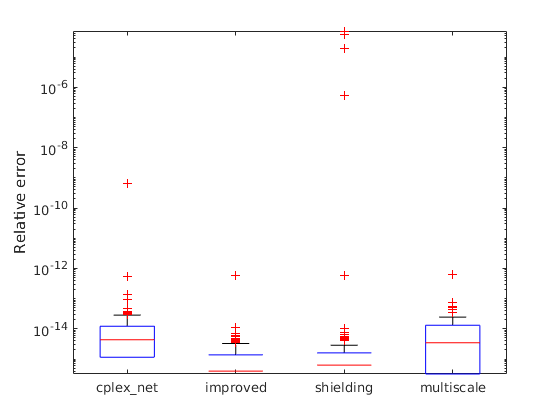

# 凸优化大作业报告

__陈子恒 1500010632__

## 第一题

我们已经非常熟悉有关于离散最佳传输问题（Discrete Optimal Transport，下简称 __DOT__ ）的线性规划表示了：
$$
\begin{align}
\textbf{min} & \sum_{i=1}^m \sum_{j=1}^n c_{ij} \pi_{ij} \\
\textbf{s.t.} & \sum_{j=1}^n \pi_{ij}=\mu_i, \forall i=1, \dots m \\ 
& \sum_{i=1}^m \pi_{ij}=\nu_j, \forall j=1, \dots n \\ 
& \pi_{ij} \ge 0.
\end{align}
$$
注意到这里传输方案 $\pi$ 是矩阵形式，写成向量形式就是
$$
\begin{align}
\textbf{min} \quad & f^T x\\
\textbf{s.t.} \quad & A x=b \\
&x \ge 0
\end{align}
$$
这里
$$
\begin{align}
f &= (c_{11}, c_{21}, \dots c_{n1}, \dots, c_{1n}, \dots c_{nn})^T \\
x &= (\pi_{11}, \pi_{21}, \dots \pi_{n1}, \dots, \pi_{1n}, \dots \pi_{nn})^T \\
A &= \begin{pmatrix} I_m & \cdots & I_m \\ E_1 &\cdots & E_n \end{pmatrix} , (E_j)_{st}=\delta_{sj} \\
b &= (\mu_1, \dots \mu_m, \nu_1, \dots \nu_n)^T.
\end{align}
$$
根据此，我们可以使用 mosek 的 `linprog` 函数计算 DOT （详见 `simple-tests/dir-mosek.m`）：

```matlab
switch opts.method
    case 'interior'
        options.Interior = 'on';
    case 'simplex'
        options.Simplex = 'on';
    otherwise
        options.Interior = 'on';
end
options.Diagnostics = 'on';
options.Display = 'iter';

[x, ~, ~, ~, ~] = linprog(f, A, b, B, c, l, u, x0, options);
```

我们分别对内点法和单纯性法进行测试，这里 $m=n=64$ ：

| method             | cpu     | error    | funcval  |
| ------------------ | ------- | -------- | -------- |
| dir_mosek_interior | 0.46802 | 0        | 0.023837 |
| dir_mosek_simplex  | 0.28712 | 5.67e-12 | 0.023837 |

这表明单纯性法较内点法有较大的优势，这也是下文所着重要讨论的问题。


## 第二题

既然 DOT 是一个有等式约束的优化问题，我们可以对原问题做 ADMM ，推导如下：

> 引入变量 $z$ ，将不等式约束隐含在目标函数中：
> $$
> \begin{align}
> \textbf{min} \quad & f^T x + I_C(z)\\
> \textbf{s.t.} \quad & \begin{pmatrix} A \\ I\end{pmatrix} x + \begin{pmatrix} 0 \\ -I\end{pmatrix}z=\begin{pmatrix} b \\ 0\end{pmatrix}, C=\{z_i \ge 0, \forall i\}
> \end{align}
> $$
> 引入乘子 $y_1 \in \mathbf{R}^{m+n}$ 与 $y_2 \in \mathbf{R}^{mn}$ ，得到迭代格式
> $$
> \begin{align}
> v_1 &\leftarrow b+y^{(k)}_1/\beta \\
> v_2 &\leftarrow z+y^{(k)}_1/\beta \\
> x^{(k+1)} &\leftarrow (A^TA+I) \backslash (A^Tv_1+v_2-f/\beta) \\
> z^{(k+1)} &\leftarrow P_C(x^{(k+1)}-y^{(k)}_2/\beta) \\
> y_1^{(k+1)} &\leftarrow y_1^{(k)} + (b-Ax^{(k+1)}) \\
> y_2^{(k+1)} &\leftarrow y_2^{(k)} + (z^{(k+1)}-x^{(k+1)})
> \end{align}
> $$
> 第三步左除是用 CG 完成的，否则精度很差。

ADMM 效果并不佳；以下是 $m=n=64$ 的测试结果：

| method             | cpu     | error      | funcval  |
| ------------------ | ------- | ---------- | -------- |
| dir_mosek_interior | 0.38076 | 0          | 0.028047 |
| dir_mosek_simplex  | 0.35575 | 1.9222e-08 | 0.028047 |
| admm_nesterov      | 8.5171  | 0.00045024 | 0.028052 |
| admm               | 6.9257  | 0.0023568  | 0.027985 |

一方面误差很大，这是由于等式约束难以起到效果的缘故。另一方面是所需时间远长于 mosek 的通用算法，这是由于 ADMM 算法会在 $x_i \approx \frac{1}{mn}$ 处停留很长时间，直至某几个变量开始出现明显的增长才使收敛步骤开始；当然这也与这是一阶算法有关。

对于对偶问题当然也可以做 ADMM ，推导步骤如下：

> 对偶问题是
> $$
> \begin{align}
> \textbf{min} \quad & b^T \nu\\
> \textbf{s.t.} \quad & f+A^T\nu \ge 0
> \end{align}
> $$
> 改写成 ADMM 的形式
> $$
> \begin{align}
> \textbf{min} \quad & b^T \nu + I_C(\lambda)\\
> \textbf{s.t.} \quad & A^T\nu - \lambda = -f
> \end{align}
> $$
> 于是迭代格式为
> $$
> \begin{align}
> \nu^{(k+1)} &\leftarrow (A^TA+\epsilon I) \backslash \left(\frac{Ax^{(k)}-b}{\beta}-A(f-\lambda^{(k)})\right) \\
> \lambda^{(k+1)} &\leftarrow P_C(A^T \nu^{(k+1)} +f - x^{(k)} /\beta) \\
> x^{(k+1)} &\leftarrow x^{(k)} - (f + A^T \nu^{(k+1)}-\lambda^{(k+1)})
> \end{align}
> $$
> 更新 $\nu$ 的一步中 $\epsilon$ 的作用是为了使左除数值稳定。

算法已经在 `simple-tests/admm_dual.m` 中实现了，但是难以在合理的时间内收敛。


## 第三题

### Transport Simplex Method

本质上来说以下所实现的三个算法都是组合优化算法，这是因为单纯形法——进一步的，传输单纯性法，充分利用了 $A$ 的稀疏结构。由于它们充分考虑了 $A$ 的特殊性，速度是很快的（以下测试为 $m=n=64$ ）：

| method                 | cpu     | error      | funcval  |
| ---------------------- | ------- | ---------- | -------- |
| dir_mosek_interior     | 0.38611 | 0          | 0.027697 |
| dir_mosek_simplex      | 0.36667 | 4.5602e-10 | 0.027697 |
| admm_nesterov          | 10.703  | 0.00083133 | 0.027701 |
| admm                   | 7.219   | 0.0025004  | 0.027714 |
| transimplex            | 0.27942 | 4.5602e-10 | 0.027697 |
| tran_simplex_normal    | 0.56725 | 4.5602e-10 | 0.027697 |
| tran_simplex_improved  | 0.64472 | 4.5602e-10 | 0.027697 |
| tran_simplex_shortlist | 0.78707 | 4.5602e-10 | 0.027697 |

完全使用 matlab 实现的单纯性法 transimplex 速度就已经能与 mosek 相提并论。

但是当规模增长后开始迅速变慢（以下测试为 $m=n=256$）：

| method                 | cpu     | error      | funcval   |
| ---------------------- | ------- | ---------- | --------- |
| dir_mosek_interior     | 0.73828 | 0          | 0.0067589 |
| dir_mosek_simplex      | 0.50615 | 2.9584e-09 | 0.0067589 |
| transimplex            | 4.6906  | 2.9584e-09 | 0.0067589 |
| tran_simplex_normal    | 0.59002 | 2.9584e-09 | 0.0067589 |
| tran_simplex_improved  | 0.65727 | 2.9584e-09 | 0.0067589 |
| tran_simplex_shortlist | 0.75122 | 2.9584e-09 | 0.0067589 |

我们使用 matlab 的 profile 工具得知主要时间花在了利用深度优先搜索确定被剔除变量的位置上，所以我们改用 C++ 和 MEX API 实现算法；结果表明速度是很快的。

#### 算法分析

传输单纯形法求解主要有两个步骤：构造初始解和更新解。

##### 初始解的构造

根据单纯性法，由于我们有 $m+n-1$ 个约束条件，所以其实只有 $m+n-1$ 个变量是自有变量，剩下的都是约束变量。根据单纯性法，如果选择 $x_{k_1}, \dots x_{k_{m+n-1}}$ 作为自由变量能使得目标函数是它们的非正线性组合，我们就达到了最优解。

由于只有自由变量能够取零，因此一个自然的想法是我们挑选每行/列代价最小的变量作为自由变量，并且尽可能满足这个变量的传输直至这一行或列的总和用尽；这就是最小费用法则（Least Cost Rule）：
$$
\begin{align}
& searchOnRow \leftarrow true \\
& row \leftarrow 1 \\
& column \leftarrow 1 \\
& \textbf{for} \quad i=1:(m+n-1) \\
& \qquad \textbf{if} \quad searchOnRow \\
& \qquad \qquad column \leftarrow \textbf{argmin}_l \quad c_{row, l} \\
& \qquad \qquad \textbf{if} \quad \mu_{row, column} \ge \nu_{row, column} \\
& \qquad \qquad \qquad \mu_{row, column} \leftarrow \mu_{row, column} - \nu_{row, column} \\
& \qquad \qquad \textbf{else} \\
& \qquad \qquad \qquad \nu_{row, column} \leftarrow \nu_{row, column} - \mu_{row, column} \\
& \qquad \qquad \qquad searchOnRow \leftarrow false \\
& \qquad \textbf{else} \\
& \qquad \qquad row \leftarrow \textbf{argmin}_l \quad c_{l, column} \\
& \qquad \qquad \textbf{if} \quad \nu_{row, column} \ge \mu_{row, column} \\
& \qquad \qquad \qquad \nu_{row, column} \leftarrow \nu_{row, column} - \mu_{row, column} \\
& \qquad \qquad \textbf{else} \\
& \qquad \qquad \qquad \mu_{row, column} \leftarrow \mu_{row, column} - \nu_{row, column} \\
& \qquad \qquad \qquad searchOnRow \leftarrow true \\
& \qquad \rm{put \quad (row, column) \quad into \quad query} \\
& \qquad c_{row, column} \leftarrow \infty \\
\end{align}
$$

##### 解的优化

为了判断一个解是不是最优的，我们先要构造对偶变量 $u \in \mathbf{R}^{m\times 1},v\in \mathbf{R}^{1\times n}$ ，并根据相对价格 $c - u \mathbf{1}^T - \mathbf{1}v^T$ 是否有负元素来判断一个解是否达到最优。详见 __[LUE08]__ 。

在找出有负相对价格的变量后，可以断定这个变量的加入使得自由变量间以同行/列为边的图产生了有且仅有一个环，那么，找到这个环上距离新加入变量距离为偶数步且运输量最少的元素，就是这一次更新需要更新的运输量。详见 `simple-tests/ctransimplex.cpp`  第 173-221 行。

####  改进要点

除了算法步骤必要的优化外，在每一步迭代的时候可以存储许多关键的信息避免重复构造

- 节点的相互连接使用图存储
- 初始解的选取（即最小费用原则）
- 在判断解是否是最优的时候，我们不需要遍历整个列表寻找最小相对价格元素；经验估计一般直接更新第一个就可以了，虽然迭代步数较多，但是搜索时间显著变短。
- 接上一条，在遍历非自由变量表时可以从上一次搜索的位置的下一行继续搜索，这样能够在较短时间内更新较多变量。见 `simple-tests/improvedtransimplex.cpp` 第 177 行 。

### Shortlist Method

在 __[GOT14]__ 中作者详细比较了不同初始解算法是否能给出一个较好的解。 Shortlist 算法的思想是预先储存一些和这个元素费用较小的邻居，在更新的时候优先搜索这些邻居；按理说这个思想是很好的，但是实际测试的时候效果不显著，主要是因为如果是随机数据的话 shortlist 基本没有价值，而如果是欧式距离的话速度肯定也没有 shielding 快。

我们开始使用图片集作为输入数据。


| method                 | cpu     | error   | funcval | average cpu |
| ---------------------- | ------- | ------- | ------- | ----------- |
| dir_mosek_simplex      | 2.3936  | 0       | 610.69  | 2.3936      |
| tran_simplex_normal    | 1.8187  | 0.46795 | 610.69  | 1.8187      |
| tran_simplex_improved  | 1.6048  | 0.49995 | 610.69  | 1.6048      |
| tran_simplex_shielding | 0.87166 | 0.48548 | 610.69  | 0.87166     |
| tran_simplex_shortlist | 1.8504  | 0.53429 | 610.69  | 1.8504      |

#### 图片的生成

数据是 $ 16 \times 16$ 分辨率的白噪声图片在 $p=2$ 的欧式距离代价。

### Shielding Method

这个算法 __[BER15]__ 的思想是如果我们能够给每一个元素 $x$ 找一族“邻居” $\Lambda_x$ ，使得
$$
\exists x^* \in \Lambda_x \quad \textbf{s.t.} \quad Cost(\tilde{x}, x) > Cost(\tilde{x}, x^*) + Cost(x^*, x)
$$
那么我们只需要每次检验邻居的相对费用是不是负的就可以了。在最简单的 $p=2$ 情形下， $\Lambda_x$ 就是 $x$ 周围的八个邻居。

详见 `pic-tests/shielding.cpp` 。

### AHA Method

所限于时间问题我们无法给出这个算法的实现。


## 第四题

参考 __[SAM17]__ 一文，我们实现一个多尺度的传输单纯形法；核心想法是建立多层的传输问题，使得每两层之间的测度和费用具有相似的关系，那么就可以在若干步“扩张-修正”的步骤之后得到原问题的最优解。

### 理论基础与算法描述

#### 建立多层次结构

已知点集 $\mathbf{X}$ 以及其上的测度 $\mu$ ，我们希望得到分解链 $(\mathbf{X}, \mu)$ 满足以下关系：
$$
\begin{align}
(\mathbf{X}, \mu) &:= (\mathbf{X_J}, \mu_\mathbf{J}) \xrightarrow{\Pi_{\mathbf{J}}} (\mathbf{X}_{\mathbf{J}-1}, \mu_{\mathbf{J}-1}) \xrightarrow{\Pi_{\mathbf{J}-1}} \cdots \xrightarrow{\Pi_0} (\mathbf{X_0}, \mu_0) \\
\Pi_j&:\mathbf{X}_j \rightarrow \mathbf{X}_{j-1}, x_j^k \mapsto x_{j-1}^{k'} \\
& \textbf{s.t.} \quad\mu_{j-1}(x_{j-1}^{k'}) = \sum_{\Pi_j(x_j^k)=x_{j-1}^{k'}} \mu_j(x_j^k).
\end{align}
$$
理解上我们可以将 $\Pi_j$ 视作取集合的操作，尽管在代码中往往还是以指针链接的方式实现的。

对于费用矩阵，我们有如下粗略的估计：
$$
\mathbf{c}_j(x_{j, k}, y_{j, k}) = \textbf{argmin}_\alpha \sum_{x\in\Pi_{j+1}^{-1}(x_{j, k}), y\in\Pi_{j+1}^{-1}(y_{j, k})} \left( \alpha - \mathbf{c}(x, y) \right)^2 = \frac{ \sum_{x\in\Pi_{j+1}^{-1}(x_{j, k}), y\in\Pi_{j+1}^{-1}(y_{j, k})} \mathbf{c}(x, y)}{|\Pi_{j+1}^{-1}(x_{j, k})|\cdot|\Pi_{j+1}^{-1}(y_{j, k})|}
$$
可以理解成是粗网格上的费用是其子费用的算数平均值。

网格结构的分解见 `pic-tests/multiscale_matlab.cpp` 的 115-165 行。

#### 解的扩张

容易知道，如果 $|X_0|=|Y_0|=1$ ，那么初始解就是 $X_0$ 向 $Y_0$ 传输 $\mu_0$ 。

论文中讨论了诸多扩张的子方案，为了保证数值稳定和扩张解的良好性质会多引入一些传输变量（即个数大于 $|\mathbf{X}_{j+1}|+|\mathbf{Y}_{j+1}|-1$ ）。由于我们之前实现的单纯形法不考虑退化情况，结合实际操作中下述的扩张方案不会引入更多的传输变量，我们总是假定，扩张后的解能够满足前文所实现的算法的输入要求。

我们使用最小列原则的变种（不选用最小费用原则主要是处于实现上的便利）；由归纳假设，第 $j$ 层的非零传输变量恰有 $|\mathbf{X}_{j}|+|\mathbf{Y}_{j}|-1$ 个（即恰有 $|\mathbf{X}_{j}|+|\mathbf{Y}_{j}|-1$ 对下标 $(k_i,k_i')$， 满足 $\pi_j^*(x_{j ,k_i},y_{j, k_i'}) > 0$ 而其余为 $0$）。在细网格 $(\mathbf{X}_{j+1}, \mathbf{Y}_{j+1}, \mathbf{c}_{j+1})$ 上找出 $|\mathbf{X}_{j+1}|+|\mathbf{Y}_{j+1}|-1$ 个传输变量：

1. 循环：对粗网格每个传输变量 $(x_{j,k_i},y_{j,k_i'}, \pi_{j,i})$ ：
  1. 从 $x_{j,k_i}$ 的第一个子节点开始
  2. 循环：遍历 $x_{j,k_i}$ 的子节点 $\tilde{x}$ 直至它的测度不是 $0$ :
    1. 寻找 $y_{j,k_i'}$ 子节点中到 $\tilde{x}$ 费用最小的，为 $\tilde{y}$
    2. 如果 $\pi_{j, i}$ 比这两个节点上的测度都小：
      1. 两节点测度减去 $\pi_{j, i}$
      2. 添加从 $x_{j,k_i}$ 到 $\tilde{y}$ 的传输 $\pi_{j,i}$ 的传输变量
      3. 回到最外层循环
    3. 如果 $\tilde{x}$ 测度较小：
      1. $\pi_{j,i}, \tilde{y}$ 减去 $\tilde{x}$ 的测度
      2. $\tilde{x}$ 到其他节点的费用设置为无穷大
    4. 如果 $\tilde{y}$ 测度较小：
      1. $\pi_{j,i}, \tilde{x}$ 减去 $\tilde{y}$ 的测度
      2. $\tilde{y}$ 到其他节点的费用设置为无穷大


这部分的代码见 242-309 行。

#### 解的修正

修正是容易的；我们直接调用此前最快的通用算法 `pic-tests/minimalrowtransimplex.cpp` 。

在数值试验中我们观察到，以 64x64 情况为例，在扩张规模为 2x2 的设置下，一共需要扩张-修正 5 次，但是前 4 次修正都在 1 秒内完成，几乎所有工作量都是在最后一次完成的。这说明在费用的估计和解的扩张上还有改进的余地。下面是输入为 96x96 随机数据时多层次算法的输出：

```plain
Decomposition completed in 0.4589s.
(9, 9, 17)
Level 1 completed in 0.0000s (total 0.4590s).
(36, 36, 71)
Level 2 completed in 0.0002s (total 0.4592s).
(144, 144, 287)
Level 3 completed in 0.0013s (total 0.4604s).
(576, 576, 1151)
Level 4 completed in 0.0279s (total 0.4884s).
(2304, 2304, 4607)
Iteration 1000	6.999614e+00
Iteration 2000	6.334159e+00
Iteration 3000	5.766333e+00
Iteration 4000	5.277581e+00
Iteration 5000	4.882786e+00
Iteration 6000	4.639914e+00
Level 5 completed in 1.3862s (total 1.8746s).
(9216, 9216, 18431)
Iteration 1000	3.194759e+00
......
Iteration 46000	1.542831e+00
Level 6 completed in 53.4041s (total 55.2787s).
55.5851s have been used in all.
```

### 数值实验
#### 数据的生成
我们选用 __[SCH17]__ 中所描述的数据集进行测试，包括：
1. 模拟图样类（Class 1-6），包括白噪声与高斯随机场；白噪声直接由 matlab 内置 `rand` 生成，高斯随机场由 R 的 RandomField 库生成。

2. 简单几何图形类（Class 7-8），包括双变量的服从柯西分布密度的图像与黑白两色的几何图形图像。

3. 真实图片类（Class 9-10），包括图像处理中常用的图片与演变图像；由于我们无法获取到原文所使用的微生物电镜图像，所以用杯子不同角度的照片代替。

以上数据均作归一化处理；另外为了避免退化情形，我们在归一化前对数据做了扰动（量级为 $10^{-9}$）。

对于 Class 1-7 ，在生成时就制定生成了从 8x8 到 96x96 尺寸的图像；对于 Class 8-10 ，我们用 GIMP 的批处理工具对图像进行缩小（使用的是三次样条差值算法）。

所有测试图像，从左至右为 Class 1-10 ；显示前经过还原处理，详情参见 `pic-tests/showTestImg.m` 。


#### 测试指标
显然平均计算时间是一个衡量不同算法在不同测试数据下的一个重要指标；另外目标值的大小也可以考察算法的精确性。

然而，次优传输变量 $\pi$ 与最优传输变量 $\pi^*$ 的距离并不能反应算法的优劣，因为这依赖于费用矩阵 $C$ 的性质。考虑以下例子：
$$
\begin{align}
\textbf{min} \quad & \textbf{tr}\left( \begin{pmatrix} 1 & 1 \\ 1+\epsilon & \sqrt{1+\epsilon^2} \end{pmatrix} \begin{pmatrix} \pi_{11} & \pi_{12} \\ \pi_{21} & \pi_{22} \end{pmatrix} \right) \\
\textbf{s.t.} \quad & \pi_{11} + \pi_{12} = 1 \\
& \pi_{21} + \pi_{22} = 1 \\
& \pi_{11} + \pi_{21} = 1 \\
& \pi_{12} + \pi_{22} = 1
\end{align}
$$
那么次优解 $\pi=\begin{pmatrix} 0 & 1 \\ 1 & 0 \end{pmatrix}$ 与最优解 $\pi^*=\begin{pmatrix} 1 & 0 \\ 0 & 1 \end{pmatrix}$ 的目标值之差小于 $\epsilon$ ，但两者化成向量后的距离是显著超过 $O(\epsilon)$ 的。

另外对于单纯性法而言，检验解是否契合约束条件意义是不显著的，因为单纯性法每一步必然从约束范围的一个顶点跳到另一个顶点，这一点与连续优化方法（如 ADMM ）等有很大的不同。

#### 测试结果
##### 24x24
以下的测试在十个类别的所有图片上完成。
| Class | mosek | cplex_lp | cplex_net | normal | improved | shielding | shortlist | multiscale |
| ----- | ----- | -------- | --------- | ------ | -------- | --------- | --------- | ---------- |
| 1     | 1.89  | 2.56     | __0.73__  | 1.45   | 1.02     | __0.73__  | 1.16      | 1.24       |
| 2     | 3.49  | 4.40     | __0.77__  | 3.23   | 1.97     | 1.16      | 2.13      | 1.29       |
| 3     | 3.93  | 5.50     | __0.81__  | 4.46   | 3.10     | 1.25      | 3.15      | 1.30       |
| 4     | 4.14  | 5.03     | __0.76__  | 3.96   | 2.76     | 1.25      | 2.88      | 1.31       |
| 5     | 3.86  | 8.06     | __0.76__  | 4.64   | 2.81     | 1.27      | 2.99      | 1.36       |
| 6     | 4.27  | 5.98     | __0.78__  | 4.66   | 3.29     | 1.34      | 3.39      | 1.32       |
| 7     | 3.44  | 4.87     | __0.77__  | 3.31   | 2.26     | 1.09      | 2.32      | 1.39       |
| 8     | 2.47  | 3.98     | __0.73__  | 2.67   | 1.38     | 0.87      | 1.49      | 1.34       |
| 9     | 2.80  | 3.89     | __0.74__  | 2.45   | 1.45     | 0.90      | 1.58      | 1.30       |
| 10    | 2.79  | 3.71     | __0.72__  | 1.49   | 1.06     | 0.77      | 1.20      | 1.30       |

|                Time used                 |              Relative error              |
| :--------------------------------------: | :--------------------------------------: |
|  |  |

##### 32x32
以下的测试在第一个类别的所有图片上完成。
| Class | mosek | cplex_lp | cplex_net | normal | improved | shielding | shortlist | multiscale |
| ----- | ----- | -------- | --------- | ------ | -------- | --------- | --------- | ---------- |
| 1     | 10.23 | 13.16    | 2.21      | 7.66   | 3.44     | __1.53__  | 3.50      | 1.70       |

|                Time used                 |              Relative error              |
| :--------------------------------------: | :--------------------------------------: |
|  |  |

可见，一般的线性规划方法速度是非常慢的，因此我们只选择一部分算法测试所有类别的数据。以下的测试在十个类别的所有图片上完成。

| Class | cplex_net | improved | shielding | multiscale |
| ----- | --------- | -------- | --------- | ---------- |
| 1     | __0.97__  | 3.26     | 1.32      | 1.51       |
| 2     | __1.06__  | 10.10    | 2.90      | 1.62       |
| 3     | __1.15__  | 14.96    | 3.32      | 1.67       |
| 4     | __1.10__  | 12.40    | 3.51      | 1.68       |
| 5     | __1.08__  | 14.55    | 4.35      | 1.84       |
| 6     | __1.10__  | 16.65    | 4.16      | 1.73       |
| 7     | __1.04__  | 10.42    | 3.13      | 1.69       |
| 8     | __1.02__  | 5.70     | 2.04      | 1.81       |
| 9     | __1.01__  | 6.63     | 2.28      | 1.68       |
| 10    | __1.03__  | 3.41     | 1.40      | 1.51       |

|                Time used                 |              Relative error              |
| :--------------------------------------: | :--------------------------------------: |
|  |  |

##### 64x64
以下的测试在第一个类别的前三张图片上完成。

| Class | cplex_net | improved | shielding | multiscale |
| ----- | --------- | -------- | --------- | ---------- |
| 1     | 13.5      | 151.58   | 29.815    | __11.722__ |

|                Time used                 |              Relative error              |
| :--------------------------------------: | :--------------------------------------: |
|  |  |

到这个规模改进的单纯形法（表中 improved 列）已经非常费时了。以下的测试在十个类别的前三张图片上完成。
| Class | cplex_net | multiscale |
| ----- | --------- | ---------- |
| 1     | 13.27     | __12.38__  |
| 2     | 21.83     | __16.25__  |
| 3     | 20.18     | __16.71__  |
| 4     | 22.26     | __17.46__  |
| 5     | 21.32     | __19.94__  |
| 6     | 23.34     | __16.76__  |
| 7     | 18.89     | __16.82__  |
| 8     | 19.73     | __16.30__  |
| 9     | 19.55     | __15.87__  |
| 10    | __15.77__ | 19.41      |

|                Time used                 |              Relative error              |
| :--------------------------------------: | :--------------------------------------: |
|  |  |

##### 96x96
以下的测试在十个类别的前三张图片上完成；其中 multiscale_s 算法是将 shielding method 作为每一层修正的子算法而得到的变形。
| Class | muultiscale | multiscale_s |
| ----- | ----------- | ------------ |
| 1     | 89.42       | __39.51__    |
| 2     | 115.30      | __58.02__    |
| 3     | 116.14      | __64.00__    |
| 4     | 116.34      | __55.60__    |
| 5     | 130.89      | __66.82__    |
| 6     | 109.82      | __61.79__    |
| 7     | 99.65       | __61.06__    |
| 8     | 142.55      | __43.12__    |
| 9     | 107.08      | __64.47__    |
| 10    | 121.48      | __57.97__    |

|                Time used                 |              Relative error              |
| :--------------------------------------: | :--------------------------------------: |
|  |  |

#### 对测试集的定性分析
未缩放的传输代价：
| Class | 24x24 | 32x32 | 64x64  | 96x96   |
| ----- | ----- | ----- | ------ | ------- |
| 1     | 0.75  | 0.83  | 0.89   | 0.94    |
| 2     | 7.83  | 11.03 | 69.24  | 186.19  |
| 3     | 19.73 | 23.56 | 68.30  | 163.20  |
| 4     | 18.45 | 18.57 | 118.37 | 167.70  |
| 5     | 69.31 | 90.84 | 202.55 | 1142.58 |
| 6     | 38.63 | 39.85 | 175.22 | 437.28  |
| 7     | 8.05  | 16.25 | 33.48  | 201.09  |
| 8     | 9.84  | 17.01 | 53.33  | 116.81  |
| 9     | 2.50  | 4.18  | 24.72  | 55.28   |
| 10    | 0.59  | 0.86  | 2.01   | 4.21    |

考虑到在代码实现中分辨率增加一倍，费用将变为原来四倍（ $p=2$ ），于是我们固定 96x96 情况，将前三个尺度下的距离缩放，得到：
| Class | 24x24   | 32x32  | 64x64  | 96x96   |
| ----- | ------- | ------ | ------ | ------- |
| 1     | 12.03   | 7.46   | 1.99   | 0.94    |
| 2     | 125.25  | 99.24  | 155.79 | 186.19  |
| 3     | 315.62  | 212.07 | 153.68 | 163.20  |
| 4     | 295.27  | 167.16 | 266.33 | 167.70  |
| 5     | 1108.94 | 817.56 | 455.73 | 1142.58 |
| 6     | 618.11  | 358.64 | 394.25 | 437.28  |
| 7     | 128.83  | 146.25 | 75.34  | 201.09  |
| 8     | 157.51  | 153.08 | 120.00 | 116.81  |
| 9     | 39.94   | 37.61  | 55.61  | 55.28   |
| 10    | 9.39    | 7.77   | 4.53   | 4.21    |
可见第五类图片之间的 Wasserstein 距离是很大的；这是由于其本身的稀疏性造成的。相较而言第一类和最后一类的距离比较小，前者是因为完全的随机性导致的，而后者是因为没两张图之间有高度的相似性引起的。

固定 32x32 的分辨率下，最优传输费用与计算时间关系如下图：

可见关系大致是线性的。

#### 算法结果比较

在不同的分辨率下，各算法解得的目标值均很接近（相对误差在 $10^{-10}$），而传输变量彼此的误差接近，这与前文所估计的是一致的。

在小规模（24x24 与 32x32）情况下， CPLEX 的网络流解法速度是最快的；到中等规模（64x64）问题时，与多尺度算法的速度相近；最大规模的问题由于内存不足，无法运行得到结果。

在最大规模问题上我们还比较了多尺度算法结合不同子算法的性能。由于测试数据假设费用矩阵是基于 $p=2$ 的 Wasserstein 距离，因此可以将 shielding method 作为子算法嵌入到多尺度算法中，实际结果也表明速度有大幅提升，但是不够精确。

本文算法的实现对内存的占用是非常经济的；作为比较，我们统计了同样规模下 CPLEX 的内存使用情况：

| Resolution | Multiscale | CPLEX  |
| ---------- | ---------- | ------ |
| 32x32      | ~24M       | ~96M   |
| 64x64      | ~400M      | ~1.46G |
| 96x96      | ~2G        | \>8G   |


### 讨论

本文所实现的多尺度算法，当问题规模较大时，有良好的性能，这一点已经在上文的数值结果中表现出来了。但是不足的是，数值精度仍然是一个较大的问题，特别是选用 shielding neighbourhood 子算法后问题尤为显著；这可能是因为在分解和扩张过程中误差逐渐积累导致的。另一个问题是本文所实现的方法并未考虑退化情形，即最优传输方案的变量个数小于 $\mathbf{X} + \mathbf{Y} -1$ 个；这个困难不是容易克服的。一种解决方案是 __[LUE08]__ 中描述的那样在遇到退化情况时在两边测度上引入 $\epsilon$ 的扰动，使之能够正常计算下去。


每一类测试数据的最优传输方案在视觉上的表现也是我们非常好奇的一个问题；这里以第十类数据的第四与第五张图片作为例子（代码实现见 `funny_pic.m` ）：

|  p   |              Result              |
| :--: | :------------------------------: |
|  1   |    |
|  2   |  |

其中 $p=1$ 时计算时间（~2min）远长于 $p=2$ 情况的时间（~20s）。猜测原因如下：


正如 shielding method 中提到的那样，遇到如上图所示的子问题时，对于 $p=2$ 的情况由于 $a^2+b^2 < c^2$ ，所以倾向于先满足 B->C->A 的路径；但是对于 $p=1$ 的情况，我们总是有 $a+b>c$ ，因此会先满足 B->A 的直接传输方案。这导致在 $p=2$ 时解是局部性的，即先满足邻居的传输才考虑较远距离的传输，但 $p=1$ 时容易出现长距离点到点的传输。在杯子一图的例子中，我们可以看到上图隐约有勺子移动的痕迹，但是下图勺子是“突然消失”的，因为最佳传输方案是用勺子四周的白色部分填充。


在本文的基础上，我们可以考虑进一步实现退化情况的处理，实现 AHA method 并比较速度，在内存空间更充裕的机器上测试更大规模的问题。


## References

+ __[LUE08]__ Luenberger, D. G., & Ye, Y. (2008). *Linear and nonlinear programming*. New York: Springer.
+ __[GOT14]__ Gottschlich, C., & Schuhmacher, D. (January 01, 2014). The Shortlist Method for fast computation of the Earth Mover's Distance and finding optimal solutions to transportation problems. *Plos One, **9, *10.)
+ __[BER15]__ [arXiv:1510.05466](https://arxiv.org/abs/1510.05466) [math.OC]
+ __[SCH17]__ Schrieber, J., Schuhmacher, D., & Gottschlich, C. (2017). DOTmark–A Benchmark for Discrete Optimal Transport. *IEEE Access*, *5*, 271-282.
+ __[SAM17]__ [arXiv:1708.02469](https://arxiv.org/abs/1708.02469) [cs.LG]